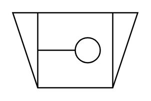

# Crusher (Jaw)

## Definition

```
{
  _style: { 
    entity: 'verticalLabelPosition=bottom;align=center;dashed=0;html=1;verticalAlign=top;shape=mxgraph.pid.crushers_grinding.crusher_(jaw);',
  },
  _width: 100,
  _height: 60,
}
```

## Usage

```
import { CrusherJaw } from '@diac/standard-components-diagrams/procEngCrushersGrinding'

<CrusherJaw/>
```

## Preview


