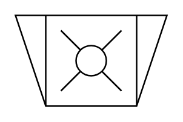
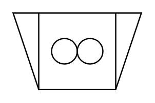
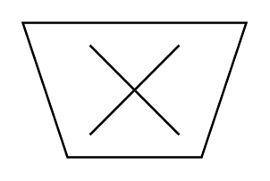
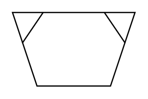
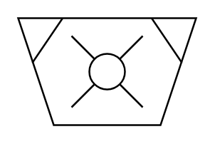

# Proc Eng Crushers Grinding Entities

- [Crusher](./crusher.md)  

- [CrusherCone](./crusher-cone.md)  

- [CrusherHammer](./crusher-hammer.md)  

- [CrusherImpact](./crusher-impact.md)  

- [CrusherJaw](./crusher-jaw.md)  

- [CrusherRoller](./crusher-roller.md)  

- [CrushingGrindingMachine](./crushing-grinding-machine.md)  

- [MillRoller](./mill-roller.md)  

- [MillVibration](./mill-vibration.md)  

- [MillPulverizer](./mill-pulverizer.md)  

- [MillPulverizerHammer](./mill-pulverizer-hammer.md)  

- [MillPulverizerImpact](./mill-pulverizer-impact.md)  

