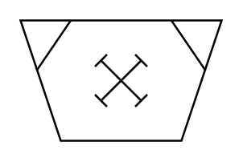

# Mill, Pulverizer (Hammer)

## Definition

```
{
  _style: 'verticalLabelPosition=bottom;align=center;dashed=0;html=1;verticalAlign=top;shape=mxgraph.pid.crushers_grinding.mill,_pulverizer_(hammer);',
  _width: 100,
  _height: 60,
}
```

## Usage

```
import { MillPulverizerHammer } from '@diac/standard-components-diagrams/procEngCrushersGrinding'

<MillPulverizerHammer/>
```

## Preview


