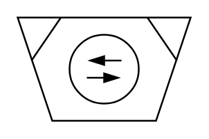

# Mill (Vibration)

## Definition

```
{
  _style: { 
    entity: 'verticalLabelPosition=bottom;align=center;dashed=0;html=1;verticalAlign=top;shape=mxgraph.pid.crushers_grinding.mill_(vibration)2;',
  },
  _original_width: 100,
  _original_height: 60,
}
```

## Usage

```
import { MillVibration } from '@diac/standard-components-diagrams/procEngCrushersGrinding'

<MillVibration/>
```

## Preview


