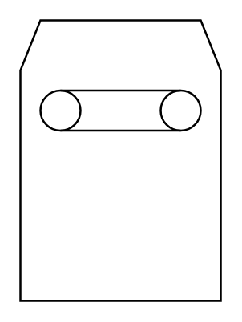
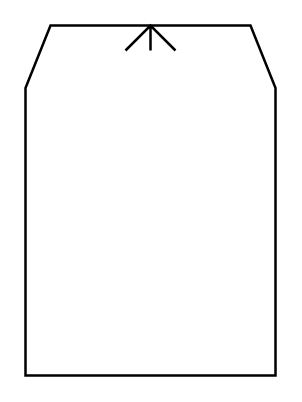
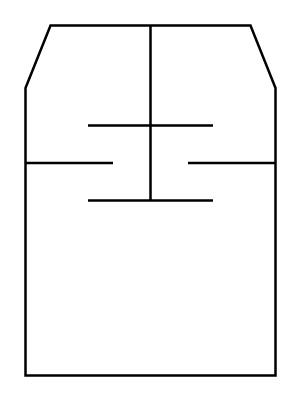

# Proc Eng Driers Entities

- [Drier](./drier.md)  

- [DrierFluidizedBed](./drier-fluidized-bed.md)  

- [DrierRollerConveyorBelt](./drier-roller-conveyor-belt.md)  

- [DryingOvenDryingChamberShelfDryer](./drying-oven-drying-chamber-shelf-dryer.md)  

- [HeatConsumer](./heat-consumer.md)  

- [RotaryDrumDrierTumblingDrier](./rotary-drum-drier-tumbling-drier.md)  

- [SprayDrier](./spray-drier.md)  

- [TurboDrierDiscDrierMovingShelfDrier](./turbo-drier-disc-drier-moving-shelf-drier.md)  

