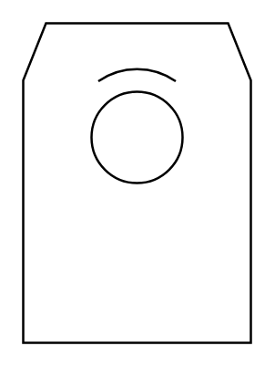

# Rotary Drum Drier, Tumbling Drier

## Definition

```
{
  _style: { 
    entity: 'shape=mxgraph.pid.driers.rotary_drum_drier,_tumbling_drier;html=1;pointerEvents=1;align=center;verticalLabelPosition=bottom;verticalAlign=top;dashed=0;',
  },
  _original_width: 100,
  _original_height: 140,
}
```

## Usage

```
import { RotaryDrumDrierTumblingDrier } from '@dinghy/standard-components-diagrams/procEngDriers'

<RotaryDrumDrierTumblingDrier/>
```

## Preview


