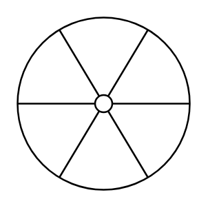

# Proportional Feeder (Rotary Valve)

## Definition

```
{
  _style: 'shape=mxgraph.pid.feeders.proportional_feeder_(rotary_valve);html=1;pointerEvents=1;align=center;verticalLabelPosition=bottom;verticalAlign=top;dashed=0;',
  _width: 60,
  _height: 60,
}
```

## Usage

```
import { ProportionalFeederRotaryValve } from '@diac/standard-components-diagrams/procEngFeeders'

<ProportionalFeederRotaryValve/>
```

## Preview


