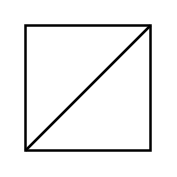

# Filter

## Definition

```
{
  _style: { 
    entity: 'verticalLabelPosition=bottom;align=center;dashed=0;html=1;verticalAlign=top;shape=mxgraph.pid.filters.filter;',
  },
  _original_width: 50,
  _original_height: 50,
}
```

## Usage

```
import { Filter } from '@diac/standard-components-diagrams/procEngFilters'

<Filter/>
```

## Preview


