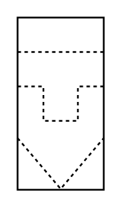

# Gas Filter (Bag, Candle, Cartridge)

## Definition

```
{
  _style: 'verticalLabelPosition=bottom;align=center;dashed=0;html=1;verticalAlign=top;shape=mxgraph.pid.filters.gas_filter_(bag,_candle,_cartridge);',
  _width: 50,
  _height: 100,
}
```

## Usage

```
import { GasFilterBagCandleCartridge } from '@diac/standard-components-diagrams/procEngFilters'

<GasFilterBagCandleCartridge/>
```

## Preview


