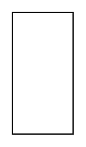

# Liquid Filter (Bag, Candle, Cartridge)

## Definition

```
{
  _style: { 
    entity: 'verticalLabelPosition=bottom;align=center;dashed=0;html=1;verticalAlign=top;shape=mxgraph.pid.filters.liquid_Filter_(bag,_candle,_cartridge);',
  },
  _width: 50,
  _height: 100,
}
```

## Usage

```
import { LiquidFilterBagCandleCartridge } from '@diac/standard-components-diagrams/procEngFilters'

<LiquidFilterBagCandleCartridge/>
```

## Preview


