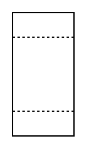

# Liquid Filter (Ion Exchanger)

## Definition

```
{
  _style: { 
    entity: 'html=1;dashed=0;outlineConnect=0;align=center;shape=mxgraph.pid.filters.liquid_filter_(ion_exchanger);',
  },
  _width: 50,
  _height: 100,
}
```

## Usage

```
import { LiquidFilterIonExchanger } from '@diac/standard-components-diagrams/procEngFilters'

<LiquidFilterIonExchanger/>
```

## Preview


