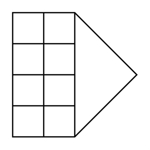

# Flame Arrestor (Detonation-Proof)

## Definition

```
{
  _style: { 
    entity: 'verticalLabelPosition=bottom;align=center;dashed=0;html=1;verticalAlign=top;shape=mxgraph.pid.fittings.flame_arrestor_(detonation-proof);',
  },
  _original_width: 100,
  _original_height: 100,
}
```

## Usage

```
import { FlameArrestorDetonationProof } from '@diac/standard-components-diagrams/procEngFittings'

<FlameArrestorDetonationProof/>
```

## Preview


