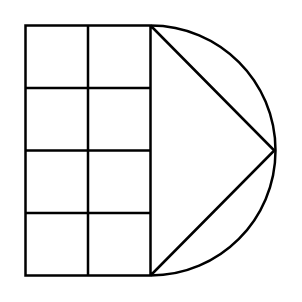

# Flame Arrestor (Fire-Resistant, Detonation-Proof)

## Definition

```
{
  _style: { 
    entity: 'verticalLabelPosition=bottom;align=center;dashed=0;html=1;verticalAlign=top;shape=mxgraph.pid.fittings.flame_arrestor_(fire-resistant,_detonation-proof);',
  },
  _width: 60,
  _height: 60,
}
```

## Usage

```
import { FlameArrestorFireResistantDetonationProof } from '@diac/standard-components-diagrams/procEngFittings'

<FlameArrestorFireResistantDetonationProof/>
```

## Preview


