# Proc Eng Fittings Entities

- [BlindDisc](./blind-disc.md)  
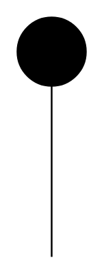

- [Breakthrough](./breakthrough.md)  
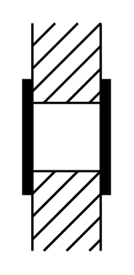

- [ClampedFlangeCoupling](./clamped-flange-coupling.md)  
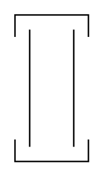

- [Compensator](./compensator.md)  
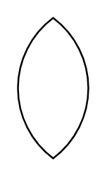

- [Coupling](./coupling.md)  
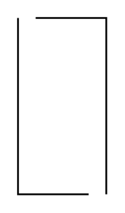

- [FlameArrestor](./flame-arrestor.md)  
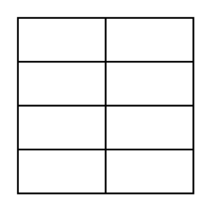

- [FlameArrestorDetonationProof](./flame-arrestor-detonation-proof.md)  

- [FlameArrestorExplosionProof](./flame-arrestor-explosion-proof.md)  

- [FlameArrestorFireResistantDetonationProof](./flame-arrestor-fire-resistant-detonation-proof.md)  

- [FlameArrestorFireResistant](./flame-arrestor-fire-resistant.md)  
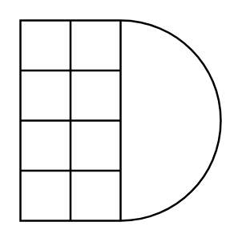

- [FlangedConnection](./flanged-connection.md)  
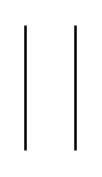

- [FlangedDummyCover](./flanged-dummy-cover.md)  
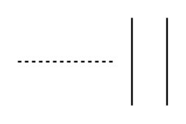

- [Funnel](./funnel.md)  

- [Hose](./hose.md)  

- [Injector](./injector.md)  
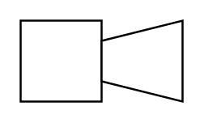

- [InterchangeableDiscBlindDisc](./interchangeable-disc-blind-disc.md)  
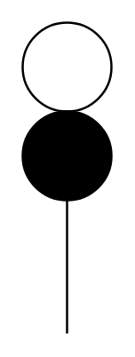

- [InterchangeableDiscOpenDiscInFunction](./interchangeable-disc-open-disc-in-function.md)  
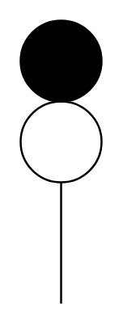

- [OpenDisc](./open-disc.md)  
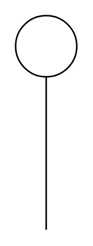

- [OrificePlate](./orifice-plate.md)  

- [Reducer](./reducer.md)  
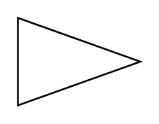

- [RuptureDisc](./rupture-disc.md)  
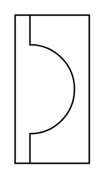

- [SelfOperatingReleaseValve](./self-operating-release-valve.md)  

- [Silencer](./silencer.md)  
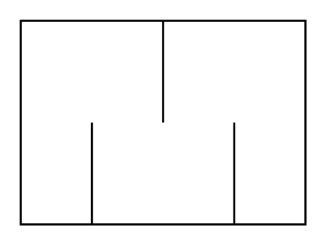

- [SingleFlange](./single-flange.md)  
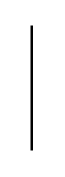

- [Strainer](./strainer.md)  

- [StrainerCone](./strainer-cone.md)  
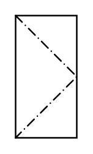

- [Vent](./vent.md)  
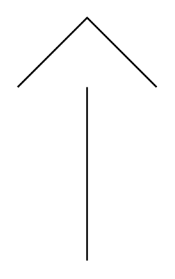

- [ViewingGlass](./viewing-glass.md)  
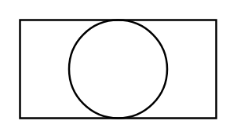

- [ViewingGlassLighting](./viewing-glass-lighting.md)  
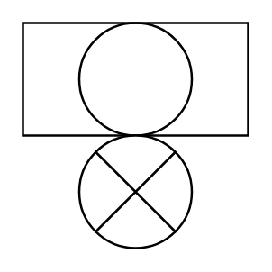
