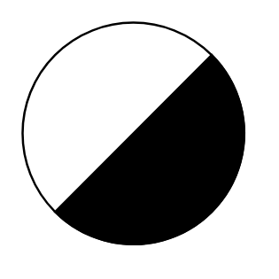

# Self-Operating Release Valve

## Definition

```
{
  _style: 'verticalLabelPosition=bottom;align=center;dashed=0;html=1;verticalAlign=top;shape=mxgraph.pid.fittings.self-operating_release_valve2;',
  _width: 105,
  _height: 105,
}
```

## Usage

```
import { SelfOperatingReleaseValve } from '@diac/standard-components-diagrams/procEngFittings'

<SelfOperatingReleaseValve/>
```

## Preview


