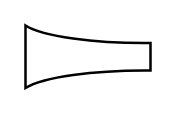
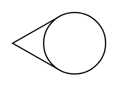
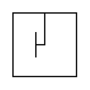

# Proc Eng Flow Sensors Entities

- [AvergingPitotTube](./averging-pitot-tube.md)  

- [Coriolis](./coriolis.md)  

- [FlowNozzle](./flow-nozzle.md)  

- [Flume](./flume.md)  

- [Magnetic](./magnetic.md)  

- [PitotTube](./pitot-tube.md)  

- [PositiveDisplacement](./positive-displacement.md)  

- [Rotameter](./rotameter.md)  

- [Target](./target.md)  

- [Turbine](./turbine.md)  

- [Ultrasonic](./ultrasonic.md)  

- [VCone](./v-cone.md)  

- [Venturi](./venturi.md)  

- [Vortex](./vortex.md)  

- [Wedge](./wedge.md)  

- [Weir](./weir.md)  

