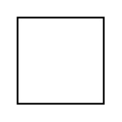

# Magnetic

## Definition

```
{
  _style: { 
    entity: 'shape=mxgraph.pid.flow_sensors.magnetic;dashed=0;align=center;html=1;fontSize=25;',
  },
  _original_width: 50,
  _original_height: 50,
}
```

## Usage

```
import { Magnetic } from '@diac/standard-components-diagrams/procEngFlowSensors'

<Magnetic/>
```

## Preview


