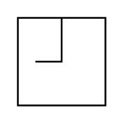

# Pitot Tube

## Definition

```
{
  _style: 'verticalLabelPosition=bottom;align=center;outlineConnect=0;dashed=0;html=1;verticalAlign=top;shape=mxgraph.pid.flow_sensors.pitot_tube;',
  _width: 50,
  _height: 50,
}
```

## Usage

```
import { PitotTube } from '@reactiac/standard-components-diagrams/procEngFlowSensors'

<PitotTube/>
```

## Preview


