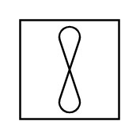

# Turbine

## Definition

```
{
  _style: { 
    entity: 'verticalLabelPosition=bottom;align=center;outlineConnect=0;dashed=0;html=1;verticalAlign=top;shape=mxgraph.pid.flow_sensors.turbine;',
  },
  _original_width: 50,
  _original_height: 50,
}
```

## Usage

```
import { Turbine } from '@dinghy/standard-components-diagrams/procEngFlowSensors'

<Turbine/>
```

## Preview


