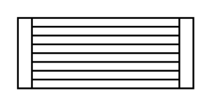

# Fixed Straight Tubes Heat Exchanger

## Definition

```
{
  _style: { 
    entity: 'shape=mxgraph.pid.heat_exchangers.fixed_straight_tubes_heat_exchanger;html=1;pointerEvents=1;align=center;verticalLabelPosition=bottom;verticalAlign=top;dashed=0;',
  },
  _original_width: 100,
  _original_height: 40,
}
```

## Usage

```
import { FixedStraightTubesHeatExchanger } from '@dinghy/standard-components-diagrams/procEngHeatExchangers'

<FixedStraightTubesHeatExchanger/>
```

## Preview


