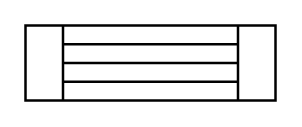

# Heat Exchanger (Straight Tubes)

## Definition

```
{
  _style: 'shape=mxgraph.pid.heat_exchangers.heat_exchanger_(straight_tubes);html=1;pointerEvents=1;align=center;verticalLabelPosition=bottom;verticalAlign=top;dashed=0;',
  _width: 100,
  _height: 30,
}
```

## Usage

```
import { HeatExchangerStraightTubes } from '@diac/standard-components-diagrams/procEngHeatExchangers'

<HeatExchangerStraightTubes/>
```

## Preview


