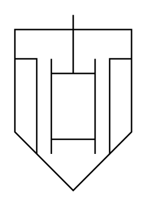

# Thin-Film Evaporator

## Definition

```
{
  _style: 'shape=mxgraph.pid.heat_exchangers.thin-film_evaporator;html=1;pointerEvents=1;align=center;verticalLabelPosition=bottom;verticalAlign=top;dashed=0;',
  _width: 80,
  _height: 120,
}
```

## Usage

```
import { ThinFilmEvaporator } from '@reactiac/standard-components-diagrams/procEngHeatExchangers'

<ThinFilmEvaporator/>
```

## Preview


