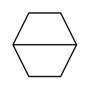

# Computer Function (control room)

## Definition

```
{
  _style: 'html=1;outlineConnect=0;align=center;dashed=0;aspect=fixed;shape=mxgraph.pid2inst.compFunc;mounting=room',
  _width: 60,
  _height: 60,
}
```

## Usage

```
import { ComputerFunctionControlRoom } from '@diac/standard-components-diagrams/procEngInstruments'

<ComputerFunctionControlRoom/>
```

## Preview


