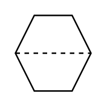

# Computer Function (inaccessible)

## Definition

```
{
  _style: 'html=1;outlineConnect=0;align=center;dashed=0;aspect=fixed;shape=mxgraph.pid2inst.compFunc;mounting=inaccessible',
  _width: 60,
  _height: 60,
}
```

## Usage

```
import { ComputerFunctionInaccessible } from '@diac/standard-components-diagrams/procEngInstruments'

<ComputerFunctionInaccessible/>
```

## Preview


