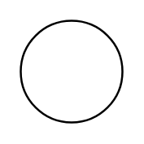

# Discrete Instrument (field)

## Definition

```
{
  _style: { 
    entity: 'html=1;outlineConnect=0;align=center;dashed=0;aspect=fixed;shape=mxgraph.pid2inst.discInst;mounting=field',
  },
  _original_width: 50,
  _original_height: 50,
}
```

## Usage

```
import { DiscreteInstrumentField } from '@diac/standard-components-diagrams/procEngInstruments'

<DiscreteInstrumentField/>
```

## Preview


