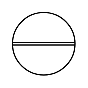

# Discrete Instrument (local panel)

## Definition

```
{
  _style: { 
    entity: 'html=1;outlineConnect=0;align=center;dashed=0;aspect=fixed;shape=mxgraph.pid2inst.discInst;mounting=local',
  },
  _width: 60,
  _height: 60,
}
```

## Usage

```
import { DiscreteInstrumentLocalPanel } from '@diac/standard-components-diagrams/procEngInstruments'

<DiscreteInstrumentLocalPanel/>
```

## Preview


