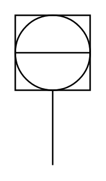

# Indicator (Control)

## Definition

```
{
  _style: 'html=1;outlineConnect=0;align=center;dashed=0;shape=mxgraph.pid2inst.indicator;mounting=room;overflow=fill;indType=ctrl',
  _width: 50,
  _height: 100,
}
```

## Usage

```
import { IndicatorControl } from '@reactiac/standard-components-diagrams/procEngInstruments'

<IndicatorControl/>
```

## Preview


