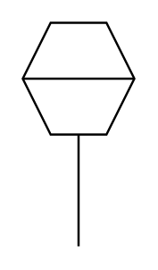

# Indicator (Function)

## Definition

```
{
  _style: { 
    entity: 'html=1;outlineConnect=0;align=center;dashed=0;shape=mxgraph.pid2inst.indicator;mounting=room;overflow=fill;indType=func',
  },
  _original_width: 50,
  _original_height: 100,
}
```

## Usage

```
import { IndicatorFunction } from '@diac/standard-components-diagrams/procEngInstruments'

<IndicatorFunction/>
```

## Preview


