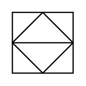

# Programmable Logic Control (control room)

## Definition

```
{
  _style: 'html=1;outlineConnect=0;align=center;dashed=0;aspect=fixed;shape=mxgraph.pid2inst.progLogCont;mounting=room',
  _width: 50,
  _height: 50,
}
```

## Usage

```
import { ProgrammableLogicControlControlRoom } from '@reactiac/standard-components-diagrams/procEngInstruments'

<ProgrammableLogicControlControlRoom/>
```

## Preview


