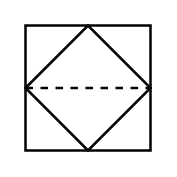

# Programmable Logic Control (inaccessible)

## Definition

```
{
  _style: { 
    entity: 'html=1;outlineConnect=0;align=center;dashed=0;aspect=fixed;shape=mxgraph.pid2inst.progLogCont;mounting=inaccessible',
  },
  _width: 60,
  _height: 60,
}
```

## Usage

```
import { ProgrammableLogicControlInaccessible } from '@diac/standard-components-diagrams/procEngInstruments'

<ProgrammableLogicControlInaccessible/>
```

## Preview


