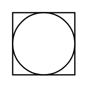

# Shared Control/Display in DCS (field)

## Definition

```
{
  _style: { 
    entity: 'html=1;outlineConnect=0;align=center;dashed=0;aspect=fixed;shape=mxgraph.pid2inst.sharedCont;mounting=field',
  },
  _original_width: 50,
  _original_height: 50,
}
```

## Usage

```
import { SharedControlDisplayInDcsField } from '@dinghy/standard-components-diagrams/procEngInstruments'

<SharedControlDisplayInDcsField/>
```

## Preview


