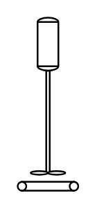

# Aerator With Sparger

## Definition

```
{
  _style: 'verticalLabelPosition=bottom;outlineConnect=0;align=center;dashed=0;html=1;verticalAlign=top;shape=mxgraph.pid.misc.aerator_with_sparger;',
  _width: 35,
  _height: 100,
}
```

## Usage

```
import { AeratorWithSparger } from '@diac/standard-components-diagrams/procEngMisc'

<AeratorWithSparger/>
```

## Preview


