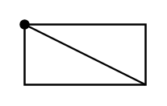

# Back Draft Damper

## Definition

```
{
  _style: 'verticalLabelPosition=bottom;outlineConnect=0;align=center;dashed=0;html=1;verticalAlign=top;shape=mxgraph.pid.misc.back_draft_damper2;',
  _width: 62,
  _height: 32,
}
```

## Usage

```
import { BackDraftDamper } from '@reactiac/standard-components-diagrams/procEngMisc'

<BackDraftDamper/>
```

## Preview


