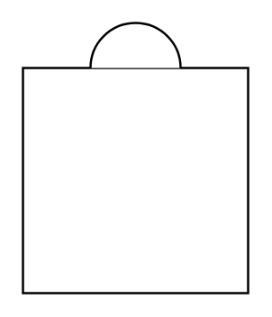

# Boiler (Dome)

## Definition

```
{
  _style: { 
    entity: 'verticalLabelPosition=bottom;outlineConnect=0;align=center;dashed=0;html=1;verticalAlign=top;shape=mxgraph.pid.misc.boiler_(dome);',
  },
  _width: 100,
  _height: 120,
}
```

## Usage

```
import { BoilerDome } from '@diac/standard-components-diagrams/procEngMisc'

<BoilerDome/>
```

## Preview


