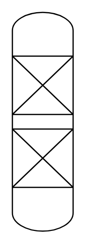

# Column (Fixed Bed)

## Definition

```
{
  _style: { 
    entity: 'verticalLabelPosition=bottom;outlineConnect=0;align=center;dashed=0;html=1;verticalAlign=top;shape=mxgraph.pid2misc.column;columnType=fixed',
  },
  _original_width: 50,
  _original_height: 180,
}
```

## Usage

```
import { ColumnFixedBed } from '@diac/standard-components-diagrams/procEngMisc'

<ColumnFixedBed/>
```

## Preview


