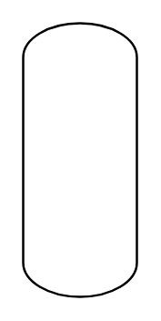

# Column

## Definition

```
{
  _style: 'verticalLabelPosition=bottom;outlineConnect=0;align=center;dashed=0;html=1;verticalAlign=top;shape=mxgraph.pid2misc.column;columnType=common',
  _width: 50,
  _height: 120,
}
```

## Usage

```
import { Column } from '@reactiac/standard-components-diagrams/procEngMisc'

<Column/>
```

## Preview


