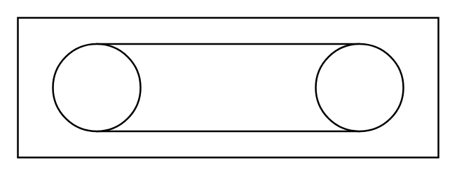

# Conveyor (Belt, Closed)

## Definition

```
{
  _style: 'verticalLabelPosition=bottom;outlineConnect=0;align=center;dashed=0;html=1;verticalAlign=top;shape=mxgraph.pid.misc.conveyor_(belt,_closed);',
  _width: 240,
  _height: 80,
}
```

## Usage

```
import { ConveyorBeltClosed } from '@diac/standard-components-diagrams/procEngMisc'

<ConveyorBeltClosed/>
```

## Preview


