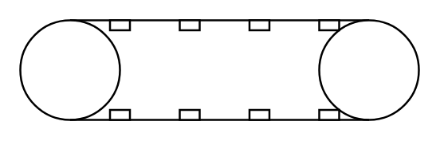

# Conveyor

## Definition

```
{
  _style: 'verticalLabelPosition=bottom;outlineConnect=0;align=center;dashed=0;html=1;verticalAlign=top;shape=mxgraph.pid2misc.conveyor',
  _width: 200,
  _height: 50,
}
```

## Usage

```
import { Conveyor } from '@reactiac/standard-components-diagrams/procEngMisc'

<Conveyor/>
```

## Preview


