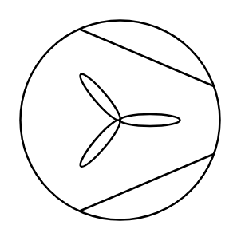

# Fan 3

## Definition

```
{
  _style: { 
    entity: 'verticalLabelPosition=bottom;outlineConnect=0;align=center;dashed=0;html=1;verticalAlign=top;shape=mxgraph.pid.misc.fan;',
  },
  _width: 60,
  _height: 60,
}
```

## Usage

```
import { Fan3 } from '@diac/standard-components-diagrams/procEngMisc'

<Fan3/>
```

## Preview


