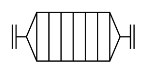

# Flame Arrestor

## Definition

```
{
  _style: { 
    entity: 'verticalLabelPosition=bottom;outlineConnect=0;align=center;dashed=0;html=1;verticalAlign=top;shape=mxgraph.pid.misc.flame_arrestor;',
  },
  _original_width: 100,
  _original_height: 40,
}
```

## Usage

```
import { FlameArrestor } from '@diac/standard-components-diagrams/procEngMisc'

<FlameArrestor/>
```

## Preview


