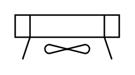

# Forced Flow Air Cooler

## Definition

```
{
  _style: 'verticalLabelPosition=bottom;outlineConnect=0;align=center;dashed=0;html=1;verticalAlign=top;shape=mxgraph.pid.misc.forced_flow_air_cooler;',
  _width: 70,
  _height: 30,
}
```

## Usage

```
import { ForcedFlowAirCooler } from '@diac/standard-components-diagrams/procEngMisc'

<ForcedFlowAirCooler/>
```

## Preview


