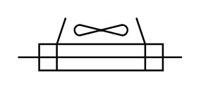

# Induced Flow Air Cooler

## Definition

```
{
  _style: { 
    entity: 'verticalLabelPosition=bottom;outlineConnect=0;align=center;dashed=0;html=1;verticalAlign=top;shape=mxgraph.pid.misc.induced_flow_air_cooler;',
  },
  _original_width: 93,
  _original_height: 30,
}
```

## Usage

```
import { InducedFlowAirCooler } from '@dinghy/standard-components-diagrams/procEngMisc'

<InducedFlowAirCooler/>
```

## Preview


