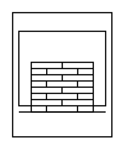

# Protective Palette Covering

## Definition

```
{
  _style: { 
    entity: 'verticalLabelPosition=bottom;outlineConnect=0;align=center;dashed=0;html=1;verticalAlign=top;shape=mxgraph.pid.misc.protective_palette_covering;',
  },
  _original_width: 80,
  _original_height: 100,
}
```

## Usage

```
import { ProtectivePaletteCovering } from '@diac/standard-components-diagrams/procEngMisc'

<ProtectivePaletteCovering/>
```

## Preview


