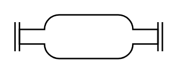

# Silencer

## Definition

```
{
  _style: 'verticalLabelPosition=bottom;outlineConnect=0;align=center;dashed=0;html=1;verticalAlign=top;shape=mxgraph.pid.misc.silencer;',
  _width: 100,
  _height: 30,
}
```

## Usage

```
import { Silencer } from '@reactiac/standard-components-diagrams/procEngMisc'

<Silencer/>
```

## Preview


