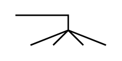

# Spraying Device

## Definition

```
{
  _style: 'verticalLabelPosition=bottom;outlineConnect=0;align=center;dashed=0;html=1;verticalAlign=top;shape=mxgraph.pid.misc.spraying_device;pointerEvents=1;',
  _width: 60,
  _height: 20,
}
```

## Usage

```
import { SprayingDevice } from '@reactiac/standard-components-diagrams/procEngMisc'

<SprayingDevice/>
```

## Preview


