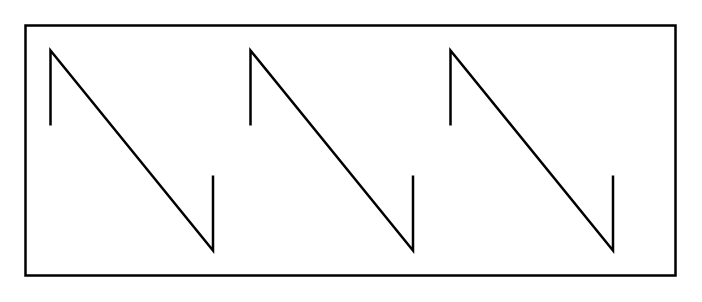

# Mixing Path

## Definition

```
{
  _style: 'shape=mxgraph.pid.mixers.mixing_path;html=1;pointerEvents=1;align=center;verticalLabelPosition=bottom;verticalAlign=top;dashed=0;',
  _width: 260,
  _height: 100,
}
```

## Usage

```
import { MixingPath } from '@reactiac/standard-components-diagrams/procEngMixers'

<MixingPath/>
```

## Preview


