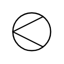

# Cone Strainer

## Definition

```
{
  _style: { 
    entity: 'verticalLabelPosition=bottom;align=center;dashed=0;html=1;verticalAlign=top;shape=mxgraph.pid.piping.cone_strainer;',
  },
  _width: 30,
  _height: 30,
}
```

## Usage

```
import { ConeStrainer } from '@diac/standard-components-diagrams/procEngPiping'

<ConeStrainer/>
```

## Preview


