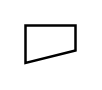

# Eccentric Reducer

## Definition

```
{
  _style: { 
    entity: 'verticalLabelPosition=bottom;align=center;dashed=0;html=1;verticalAlign=top;shape=mxgraph.pid.piping.eccentric_reducer;',
  },
  _original_width: 20,
  _original_height: 15,
}
```

## Usage

```
import { EccentricReducer } from '@diac/standard-components-diagrams/procEngPiping'

<EccentricReducer/>
```

## Preview


