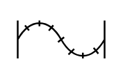

# Flexible Hose

## Definition

```
{
  _style: 'verticalLabelPosition=bottom;align=center;dashed=0;html=1;verticalAlign=top;shape=mxgraph.pid.piping.flexible_hose;pointerEvents=1;',
  _width: 50,
  _height: 25,
}
```

## Usage

```
import { FlexibleHose } from '@diac/standard-components-diagrams/procEngPiping'

<FlexibleHose/>
```

## Preview


