# Proc Eng Piping Entities

- [BasketStrainer](./basket-strainer.md)  
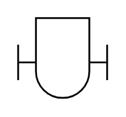

- [Blank](./blank.md)  
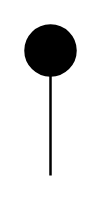

- [Breather](./breather.md)  
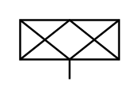

- [Cap](./cap.md)  
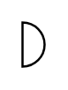

- [ClosedFigure8Blind](./closed-figure-8-blind.md)  

- [ConcentricReducer](./concentric-reducer.md)  
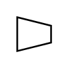

- [ConeStrainer](./cone-strainer.md)  

- [Damper](./damper.md)  
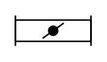

- [DesuperHeater](./desuper-heater.md)  

- [DetonationArrestor](./detonation-arrestor.md)  
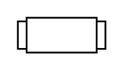

- [DiverterValve](./diverter-valve.md)  
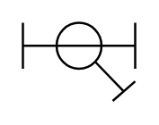

- [DoubleFlange](./double-flange.md)  
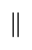

- [DuplexStrainer](./duplex-strainer.md)  
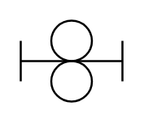

- [EccentricReducer](./eccentric-reducer.md)  

- [ExcessFlowValve](./excess-flow-valve.md)  
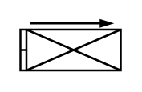

- [ExhaustHead](./exhaust-head.md)  
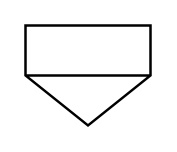

- [ExpansionJoint](./expansion-joint.md)  
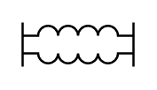

- [FlameArrestor](./flame-arrestor.md)  

- [Flange](./flange.md)  
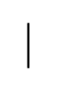

- [FlangeIn](./flange-in.md)  
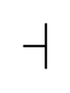

- [FlexibleHose](./flexible-hose.md)  

- [HoseConnection](./hose-connection.md)  
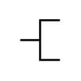

- [InLineMixer](./in-line-mixer.md)  
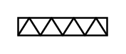

- [InLineSilencer](./in-line-silencer.md)  

- [OpenFigure8Blind](./open-figure-8-blind.md)  
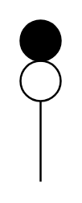

- [OrificeQuickChange](./orifice-quick-change.md)  
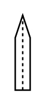

- [Plug](./plug.md)  

- [PulsationDampener](./pulsation-dampener.md)  
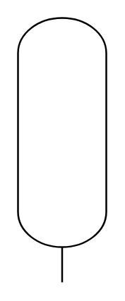

- [RemovableSpool](./removable-spool.md)  

- [RotaryValve](./rotary-valve.md)  

- [Spacer](./spacer.md)  

- [SteamTrap](./steam-trap.md)  
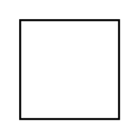

- [TTypeStrainer](./t-type-strainer.md)  

- [TemporaryStrainer](./temporary-strainer.md)  
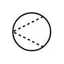

- [VentSilencer](./vent-silencer.md)  
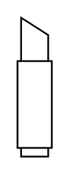

- [WeldedConnection](./welded-connection.md)  
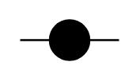

- [YTypeStrainer](./y-type-strainer.md)  

